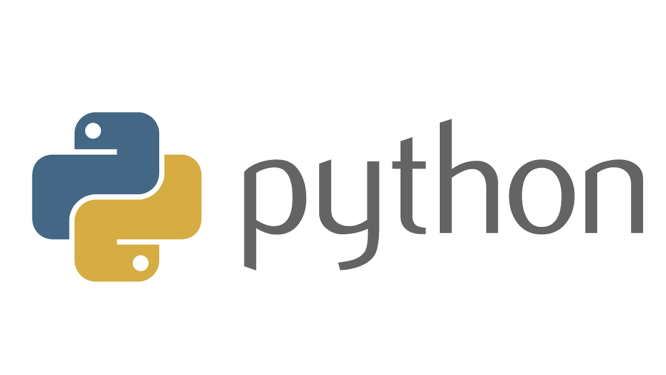

# Python3

Python3 is the programming language which will be used in most of TUM.ai's projects.

## Installation
You can install python by typing  
`sudo apt-get install python3`  
into the terminal.  
**TASK**: Install python3

## IDE installation
  
As an IDE, I would recommend using PyCharm by JetBrains. It is a great, easy-to-use and very powerful development environment.
As a student, you can get the Professional version for free by applying under this link:
https://www.jetbrains.com/community/education/#students  
The installation is differently depending on your operation system.   
**TASK**: Download *PyCharm*  
  
Now, open this repository in PyCharm. 

## Setting the python interpreter
To run a program using python, you need to specify the python interpreter which shall be used.  
Therefore, in PyCharm click `File > Settings > Project > Project Interpreter`  
In the top of this window, you can select a python interpreter. For now, just select any python3 interpreter you can find. 

## Using Python
Python is an interpreted programming language - so there is no need to compile anything.
A sample python file which shows some simple python commands is located at *"2-python/python-tutorial.py"*

**TASK**: Open the terminal window in the bottom left of PyCharm and enter the command  
`python 2-python/python-tutorial.py`  
This executes the python script. Try to understand the python script and what is happening by opening it in PyCharm through the Project window in the left.
You can also run the script by right-clicking on the file or clicking the green play button in PyCharm.

## End
You have now run your first python program. In the next part of the tutorial, we will use some important packages and learn how to use virtual environments.