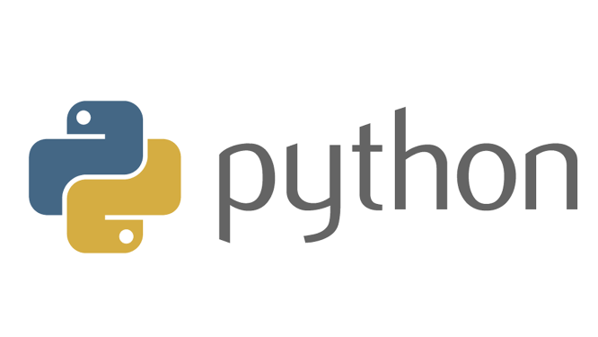

# Python3
  
Python3 is the programming language which will be used in most of TUM.ai's projects.

## Installation
The python installation on windows is a bit more complicated than for Linux.  
I recommend installing Anaconda to manage python environments under Windows.  
**TASK**: Install Anaconda on https://www.anaconda.com/products/individual  
This should automatically also install the latest version of python3. During the installation, it is very important to add python to the windows PATH. 
This is an option which the installer should provide, so you only need to check the box.  
**TASK**: Check your python installation by typing `python` into the windows CMD shell. If the installation was done correctly,
the terminal should print your python version. You can exit python by typing `quit()`.

## IDE installation
  
As an IDE, I would recommend using PyCharm by JetBrains. It is a great, easy-to-use and very powerful development environment. It also has built-in support for Anaconda and Git.
As a student, you can get the Professional version for free by applying under this link:
https://www.jetbrains.com/community/education/#students  

**TASK**: Download and install *PyCharm*  
  
Then, open this repository in PyCharm. 

## Setting the python interpreter
To run a program using python, you need to specify the python interpreter which shall be used.  
Therefore, in PyCharm click `File > Settings > Project > Project Interpreter`  
In the top of this window, you can select a python interpreter. For now, just select any python3 interpreter you can find. 
 
If there is no interpreter in this list, the python installation is not found automatically. In this case, I would recommend reinstalling Python3 from 
https://www.python.org/downloads/ . Make sure to add Python3 to the PATH this time!

## Using Python
Python is an interpreted programming language - so there is no need to compile anything.
A sample python file which shows some simple python commands is located at *"2-python/python-tutorial.py"*

**TASK**: Open the terminal window in the bottom left of PyCharm and enter the command  
`python 2-python/python-tutorial.py`  
This executes the python script. Try to understand the python script and what is happening by opening it in PyCharm through the Project window in the left.
You can also run the script by right-clicking on the file or clicking the green play button in PyCharm.
 
## End
You have now run your first python program. In the next part of the tutorial, we will use some important packages learn how to use virtual environments.