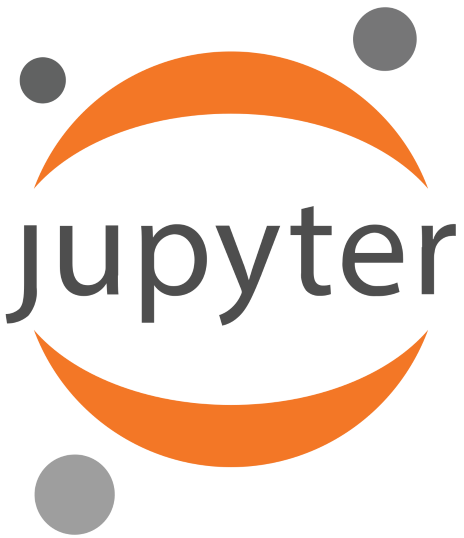

# Python3 Jupyter Notebooks
   
Jupyter Notebooks are great for showcasing your code and presenting your data in plots.  
Jupyter Notebooks are special python files, which are opened in a browser. The code is then split into cells, which can be run separately.

## Installation

**Anaconda**:  
When using Anaconda and its virtual environments, jupyter notebook is best installed through the Anaconda Navigator.  
Open the *Anaconda Navigator*, then make sure that the correct environment is selected in the environments tab.  
Then, click on *Home* and install the *Jupyter Notebook* application in the environment.  
  
**Command Line**:  
After activating the correct environment, type  
`pip install notebook`.
  
**TASK**: Install jupyter notebook in your environment.

## Starting
**Anaconda**:  
In the Anaconda Home Menu and after selecting your environment, select Launch below the *Jupyter Notebook* application. 
  
**Command Line**:  
After activating the correct environment, type  
`jupyter notebook` into the terminal. Jupyter Notebook will be opened in the folder you are currently at. Running jupyter notebook from the root of your project is recommended.

After starting jupyter notebook, you will see a menu with folders in your browser.

**TASK**: Start jupyter notebook, then go to the tech-tutorial project folder, then to 5-jupyter and open the file *JupyterExample.ipynb* .

## Usage
The notebook which you have opened now, should be pretty self-explanatory. It contains Python Code in cells, which you can run separately.  
This means, that you can run cells again if there was an error without having to run the previous code again, too.  
You can run a cell by pressing `Shift + Enter` or by pressing the run button in the top of the page. You can start from the beginning again by pressing `Kernel > Restart and Clear Output`.
  
**TASK**: Go through the provided jupyter notebook and train your first neural network.

## End
This concludes the TUM.ai tech introduction. You should now be able to setup a toolchain for a software development project in python.
A separate part of the TUM.ai Onboarding will provide you with further information and tutorials, if you require them.  
  
I hope this tutorial helps you when starting into software development. Good luck and have a great time at TUM.ai!